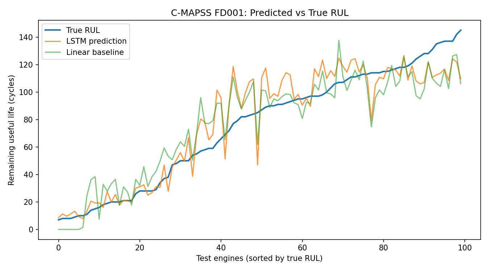

# Turbofan Engine Remaining Useful Life (RUL) Prediction

Predicting how many flight cycles a jet engine has left before failure, using multivariate sensor data and an LSTM neural network. Predictive maintenance is a core problem in aviation: servicing engines before they fail reduces unplanned downtime and cost.

## Dataset
NASA C-MAPSS **FD001** (Commercial Modular Aero-Propulsion System Simulation): 100 training engines run to failure, 100 test engines cut off before failure, 21 sensors and 3 operating settings per cycle.

Citation: A. Saxena and K. Goebel (2008). *Turbofan Engine Degradation Simulation Data Set*, NASA Ames Prognostics Data Repository, NASA Ames Research Center, Moffett Field, CA.

## Approach
1. **Labeling:** RUL = last cycle of the engine minus the current cycle, capped at 125 (early-life degradation is not visible in the sensors).
2. **Preprocessing:** removed constant sensors, scaled features with MinMaxScaler fitted on training data only.
3. **Windowing:** 30-cycle sliding windows; each window is labeled with the RUL at its last cycle.
4. **Validation:** 15 training engines held out entirely (split by engine to avoid leakage between overlapping windows).
5. **Models:**
   - Baseline: linear regression on flattened windows
   - LSTM: 2 stacked LSTM layers (64, 32) with dropout, a dense layer, Adam optimizer, early stopping
6. **Evaluation:** last 30 cycles of each test engine vs. the provided true RUL.

## Results (FD001 test set)

| Model | RMSE (cycles) | NASA score (lower is better) |
| Linear regression (baseline) | 16.31 | 413 |
| LSTM | **15.18** | **396** |

The LSTM reduced RMSE by 6.9% versus the baseline. The NASA score is the asymmetric PHM08 metric, which penalizes late predictions more heavily than early ones.

## How to run
1. Open `turbofan_rul_colab.ipynb` in Google Colab (or Jupyter).
2. Run all cells. The notebook downloads the dataset automatically; if that fails, place `train_FD001.txt`, `test_FD001.txt` and `RUL_FD001.txt` in a `CMAPSSData` folder.
3. Requirements: Python 3, TensorFlow, scikit-learn, pandas, numpy, matplotlib.

## Limitations and next steps
- C-MAPSS is simulated data, so it is cleaner than real fleet data (noise, missing values, varied conditions).
- Only FD001 (one operating condition, one fault mode) was used.
- Future work: test FD002/FD004 (multiple operating conditions), compare GRU and 1D-CNN models, tune window size and RUL cap, and add prediction uncertainty estimates.

## Files
- `turbofan_rul_colab.ipynb`: full notebook
- `rul_predictions.png`: predicted vs true RUL plot
- `training_curve.png`: training and validation loss
